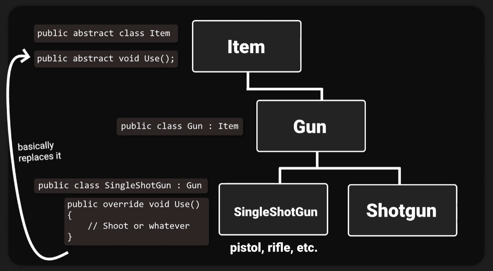

# FPS Multiplayer

Repo para la entrega de FPS en Motores

## Arquitectura Multiplayer

Vamos a tener dos prefabs

**Player Manager:**

- Se encarga de la persistencia de datos del jugador
- Respawn y muerte
- Recibir informacion de otros jugadores

**Player Controller:**

- Movimiento del jugador
- Disparo

Esta estructura es necesaria para que pueda haber un intercambio de datos entre los jugadores y la partida. Por ejemplo si no tuviesemos esta
estructura separada en un Manager y un Controller, si yo elimino a otro jugador, el otro jugador debe saber que ha sido eliminado por mi, y yo quiero ver
que he eliminado a ese jugador. Esta comunicación no sería posible, porque si destruimos el GameObject del enemigo, no podremos enviar la información.

Estos dos prefabs van a ser generados por un `RoomManager`, un empty que tendremos en la escena. El `RoomManager` se va a encargar de crear el `PlayerManager` cuando
nos unimos a la sala, y el `PlayerManager` se va a encargar de crear el `PlayerController`. Cuando salgamos de la escena, el `PlayerManager` y el `PlayerController` seran 
destruidos automaticamente por Photon.

```
RoomManager -> PlayerManager -> PlayerController
```

## Clases abstractas y herencia

Vamos a tener una clase abstracta `Item`, con método abstracto `Use()`. Cada vez que queramos usar el objeto que tenemos en la mano, llamaremos al método `Use()`.

En nuestro juego tenemos una clase `Gun` que va a implementar esta clase `Item`, así que podremos usar el método `Use()`. Las armas tendrán distintos scripts dependiendo de cual estemos utilizando. `SingleShotGun` para armas que disparen una bala a la vez (pistolas o rifles), y `Shotgun` para armas que disparan más de una bala a la vez (escopetas). Estos dos scripts implementan la clase `Gun`, y podrán hacer uso del método `Use()` de la clase `Item`.

Lo importante de esta estructura es que a medida que añadimos más items al juego, la clase `PlayerController` no tiene que saber o implementar la existencia de cada uno de ellos, simplemente llamará al método `Use()` de ese arma/item.

Diagrama:



## Pun Remote Procedure Calls (RPCs)

Documentación de Photon sobre [RPCs](https://doc.photonengine.com/pun/current/gameplay/rpcsandraiseevent)

RPCs (Remote Procedure Calls) son llamadas a métodos en los clientes remotos que se encuentran en la misma sala. Para habilitar esta llamada tienes que añadir `[PunRPC]` al método que quieras que se ejecute en el resto de clientes.

``` C#
[PunRPC]
void ChatMessage(string a, string b)
{
    Debu.Log(string.Format("ChatMessage {0} {1}", a, b));
}
```

Para hacer llamadas a estos métodos necesitas un componente `PhotonView` y se usa de la siguiente forma:

- Entre comillas el nombre del método marcado con `[PunRPC]`
- A quien va a ser enviado este método `RpcTarget.All` (a todos)
- Los parámetros de la función.

``` C#
PhotonView pv = PhotonView.Get(this)
pv.RPC("ChatMessage", RpcTarget.All, "jup", "and jup");
```

El componente `PhotonView` es un "objetivo" para el RPC. Todos los clientes ejecutan el método sólo en el GameObject en la red con ese PhotonView específico. Si usas un método RPC `ApplyDamage`, todos los clientes que reciben el método aplicarán el daño al mismo objetivo.